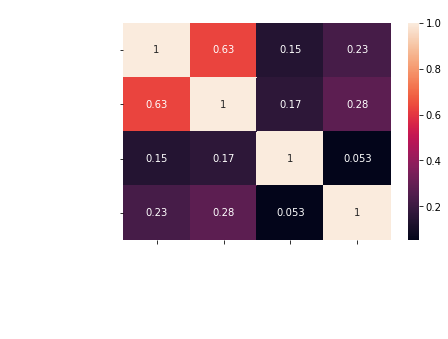
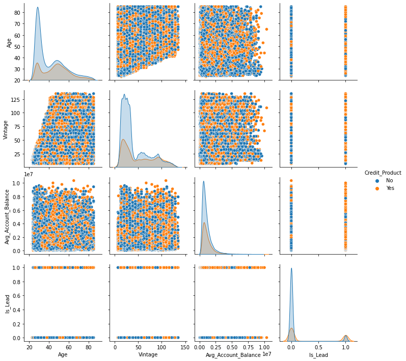
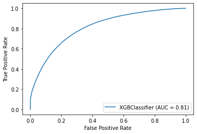

# JOB_A_THON

> BY: ABHISHEK KUMAR

### AIM: _Credit Card Lead Prediction_


## Importing Libraries


```python
import pandas as pd                                       #pandas for dataframe manipulation
import numpy as np                                        #numpy for array manipulation
import matplotlib.pyplot as plt                           #pyplot for plotting
import seaborn as sns                                     #seaborn for attractive plotting
from sklearn.preprocessing import LabelEncoder            #enncoding the string caegorical value
from sklearn.model_selection import train_test_split      #for splitting the dataset
from sklearn.preprocessing import StandardScaler          #for feature scaling since we might use regression method
```

## Importing Dataset


```python
train = pd.read_csv("train.csv")                          #train dataset is imported
train = train.set_index('ID')                             #id of train is set as index
train.head()                                              #to see top 5 column of dataset
```


<div>
<style scoped>
    .dataframe tbody tr th:only-of-type {
        vertical-align: middle;
    }

    .dataframe tbody tr th {
        vertical-align: top;
    }

    .dataframe thead th {
        text-align: right;
    }
</style>
<table border="1" class="dataframe">
  <thead>
    <tr style="text-align: right;">
      <th></th>
      <th>Gender</th>
      <th>Age</th>
      <th>Region_Code</th>
      <th>Occupation</th>
      <th>Channel_Code</th>
      <th>Vintage</th>
      <th>Credit_Product</th>
      <th>Avg_Account_Balance</th>
      <th>Is_Active</th>
      <th>Is_Lead</th>
    </tr>
    <tr>
      <th>ID</th>
      <th></th>
      <th></th>
      <th></th>
      <th></th>
      <th></th>
      <th></th>
      <th></th>
      <th></th>
      <th></th>
      <th></th>
    </tr>
  </thead>
  <tbody>
    <tr>
      <th>NNVBBKZB</th>
      <td>Female</td>
      <td>73</td>
      <td>RG268</td>
      <td>Other</td>
      <td>X3</td>
      <td>43</td>
      <td>No</td>
      <td>1045696</td>
      <td>No</td>
      <td>0</td>
    </tr>
    <tr>
      <th>IDD62UNG</th>
      <td>Female</td>
      <td>30</td>
      <td>RG277</td>
      <td>Salaried</td>
      <td>X1</td>
      <td>32</td>
      <td>No</td>
      <td>581988</td>
      <td>No</td>
      <td>0</td>
    </tr>
    <tr>
      <th>HD3DSEMC</th>
      <td>Female</td>
      <td>56</td>
      <td>RG268</td>
      <td>Self_Employed</td>
      <td>X3</td>
      <td>26</td>
      <td>No</td>
      <td>1484315</td>
      <td>Yes</td>
      <td>0</td>
    </tr>
    <tr>
      <th>BF3NC7KV</th>
      <td>Male</td>
      <td>34</td>
      <td>RG270</td>
      <td>Salaried</td>
      <td>X1</td>
      <td>19</td>
      <td>No</td>
      <td>470454</td>
      <td>No</td>
      <td>0</td>
    </tr>
    <tr>
      <th>TEASRWXV</th>
      <td>Female</td>
      <td>30</td>
      <td>RG282</td>
      <td>Salaried</td>
      <td>X1</td>
      <td>33</td>
      <td>No</td>
      <td>886787</td>
      <td>No</td>
      <td>0</td>
    </tr>
  </tbody>
</table>
</div>


```python
test = pd.read_csv("test.csv")                            #test dataset is imported
test = test.set_index('ID')                               #id of test is set as index
test.head()                                               #to see top 5 column of dataset
```


<div>
<style scoped>
    .dataframe tbody tr th:only-of-type {
        vertical-align: middle;
    }

    .dataframe tbody tr th {
        vertical-align: top;
    }

    .dataframe thead th {
        text-align: right;
    }
</style>
<table border="1" class="dataframe">
  <thead>
    <tr style="text-align: right;">
      <th></th>
      <th>Gender</th>
      <th>Age</th>
      <th>Region_Code</th>
      <th>Occupation</th>
      <th>Channel_Code</th>
      <th>Vintage</th>
      <th>Credit_Product</th>
      <th>Avg_Account_Balance</th>
      <th>Is_Active</th>
    </tr>
    <tr>
      <th>ID</th>
      <th></th>
      <th></th>
      <th></th>
      <th></th>
      <th></th>
      <th></th>
      <th></th>
      <th></th>
      <th></th>
    </tr>
  </thead>
  <tbody>
    <tr>
      <th>VBENBARO</th>
      <td>Male</td>
      <td>29</td>
      <td>RG254</td>
      <td>Other</td>
      <td>X1</td>
      <td>25</td>
      <td>Yes</td>
      <td>742366</td>
      <td>No</td>
    </tr>
    <tr>
      <th>CCMEWNKY</th>
      <td>Male</td>
      <td>43</td>
      <td>RG268</td>
      <td>Other</td>
      <td>X2</td>
      <td>49</td>
      <td>NaN</td>
      <td>925537</td>
      <td>No</td>
    </tr>
    <tr>
      <th>VK3KGA9M</th>
      <td>Male</td>
      <td>31</td>
      <td>RG270</td>
      <td>Salaried</td>
      <td>X1</td>
      <td>14</td>
      <td>No</td>
      <td>215949</td>
      <td>No</td>
    </tr>
    <tr>
      <th>TT8RPZVC</th>
      <td>Male</td>
      <td>29</td>
      <td>RG272</td>
      <td>Other</td>
      <td>X1</td>
      <td>33</td>
      <td>No</td>
      <td>868070</td>
      <td>No</td>
    </tr>
    <tr>
      <th>SHQZEYTZ</th>
      <td>Female</td>
      <td>29</td>
      <td>RG270</td>
      <td>Other</td>
      <td>X1</td>
      <td>19</td>
      <td>No</td>
      <td>657087</td>
      <td>No</td>
    </tr>
  </tbody>
</table>
</div>


## EDA


```python
train.keys()                                              #to know the column name of dataset
```


    Index(['Gender', 'Age', 'Region_Code', 'Occupation', 'Channel_Code', 'Vintage',
           'Credit_Product', 'Avg_Account_Balance', 'Is_Active', 'Is_Lead'],
          dtype='object')


```python
train.dtypes                                              #to know datatype of each column
```


    Gender                 object
    Age                     int64
    Region_Code            object
    Occupation             object
    Channel_Code           object
    Vintage                 int64
    Credit_Product         object
    Avg_Account_Balance     int64
    Is_Active              object
    Is_Lead                 int64
    dtype: object


> We can observe that there are few attributes which have object type data which should be convereted for mathematical operation on data.


```python
train.isna().sum()                                         #to check each null value in test data
```


    Gender                     0
    Age                        0
    Region_Code                0
    Occupation                 0
    Channel_Code               0
    Vintage                    0
    Credit_Product         29325
    Avg_Account_Balance        0
    Is_Active                  0
    Is_Lead                    0
    dtype: int64


```python
test.isna().sum()                                         #to check null value in train dataset
```


    Gender                     0
    Age                        0
    Region_Code                0
    Occupation                 0
    Channel_Code               0
    Vintage                    0
    Credit_Product         12522
    Avg_Account_Balance        0
    Is_Active                  0
    dtype: int64


```python
#to check unique value in each object datatype
for i in train.columns:                                  #for each column name
    if train[i].dtype == 'object':                       #if coolumn has object datatype
        print(i,"\t\t\t--------------->\t\t",train[i].unique(),"\n")     #find unique value
```

    Gender 			--------------->		 ['Female' 'Male'] 
    
    Region_Code 			--------------->		 ['RG268' 'RG277' 'RG270' 'RG282' 'RG261' 'RG265' 'RG283' 'RG254' 'RG269'
     'RG257' 'RG279' 'RG280' 'RG252' 'RG284' 'RG259' 'RG281' 'RG258' 'RG266'
     'RG260' 'RG274' 'RG256' 'RG275' 'RG273' 'RG267' 'RG272' 'RG251' 'RG262'
     'RG264' 'RG278' 'RG276' 'RG263' 'RG250' 'RG255' 'RG253' 'RG271'] 
    
    Occupation 			--------------->		 ['Other' 'Salaried' 'Self_Employed' 'Entrepreneur'] 
    
    Channel_Code 			--------------->		 ['X3' 'X1' 'X2' 'X4'] 
    
    Credit_Product 			--------------->		 ['No' nan 'Yes'] 
    
    Is_Active 			--------------->		 ['No' 'Yes'] 
    
    

> Here we can observe that:
> 1. Apart from NAN there is no value where we might have doubt that any noise in the data to manipulate null value.
>
> 2. There are so much of Region code which gives us intuition that it might be big country like USA (Most probably). Since in Asian country credit is not so common apart from big metroploitian city and European country has not so much of region in a solo region.
>
> 3. There are 29325 null value in train data and 12522 null value in test data in "Credit_Product" attribute.


```python
#Correlation matrix 
corrMatrix = train.corr()                              #creating correlation matrix
print (corrMatrix)                                     #printingcorrelation matrix
sns.heatmap(corrMatrix, annot=True,color="red")        #plotting heatmap of correlation matrix
plt.title("Correlation Analysis",color="white")        #adding title
plt.xticks(rotation=45,color="white")                  #rotating label tick and adding color
plt.yticks(color="white")                              #rotating label tick and adding color
plt.show()                                             #plotting graph
```

                              Age   Vintage  Avg_Account_Balance   Is_Lead
    Age                  1.000000  0.631242             0.145232  0.230814
    Vintage              0.631242  1.000000             0.167433  0.279642
    Avg_Account_Balance  0.145232  0.167433             1.000000  0.053370
    Is_Lead              0.230814  0.279642             0.053370  1.000000
    


    

    


> Very poor relation of "Is_Lead" with all the other integer dtype attribute
> Regression might be bad choice. I think it will help we go for random forest


```python
sns.pairplot(train,hue="Credit_Product")                         #to plot pair plot and analyse the data
plt.title("Pair Plot",color="white")        #adding title
plt.xticks(rotation=45,color="white")                  #rotating label tick and adding color
plt.yticks(color="white")                              #rotating label tick and adding color
plt.show()                                             #plotting graph
```


    

    


> There is no clear pattern can be recognised.
> But the people with age between(20-40) have less number of Credit Product


```python
train = train.fillna(train['Credit_Product'].value_counts().index[0])    #filling missing value with on with higher number of yes or no 
test= test.fillna(test['Credit_Product'].value_counts().index[0])        #filling missing value with on with higher number of yes or no
```


```python
train.isna().sum()                                  # check for missing values after modifying
```


    Gender                 0
    Age                    0
    Region_Code            0
    Occupation             0
    Channel_Code           0
    Vintage                0
    Credit_Product         0
    Avg_Account_Balance    0
    Is_Active              0
    Is_Lead                0
    dtype: int64


```python
test.isna().sum()                                  # check for missing values after modifying
```


    Gender                 0
    Age                    0
    Region_Code            0
    Occupation             0
    Channel_Code           0
    Vintage                0
    Credit_Product         0
    Avg_Account_Balance    0
    Is_Active              0
    dtype: int64


## Encoding Categorical Data


```python
lb_make = LabelEncoder()                      #label encoding of train data
for i in train.columns:                       #for each column
    if train[i].dtype == 'object':            #if column is object dtype
        train[i] = lb_make.fit_transform(train[i])  

train.head() 
```


<div>
<style scoped>
    .dataframe tbody tr th:only-of-type {
        vertical-align: middle;
    }

    .dataframe tbody tr th {
        vertical-align: top;
    }

    .dataframe thead th {
        text-align: right;
    }
</style>
<table border="1" class="dataframe">
  <thead>
    <tr style="text-align: right;">
      <th></th>
      <th>Gender</th>
      <th>Age</th>
      <th>Region_Code</th>
      <th>Occupation</th>
      <th>Channel_Code</th>
      <th>Vintage</th>
      <th>Credit_Product</th>
      <th>Avg_Account_Balance</th>
      <th>Is_Active</th>
      <th>Is_Lead</th>
    </tr>
    <tr>
      <th>ID</th>
      <th></th>
      <th></th>
      <th></th>
      <th></th>
      <th></th>
      <th></th>
      <th></th>
      <th></th>
      <th></th>
      <th></th>
    </tr>
  </thead>
  <tbody>
    <tr>
      <th>NNVBBKZB</th>
      <td>0</td>
      <td>73</td>
      <td>18</td>
      <td>1</td>
      <td>2</td>
      <td>43</td>
      <td>0</td>
      <td>1045696</td>
      <td>0</td>
      <td>0</td>
    </tr>
    <tr>
      <th>IDD62UNG</th>
      <td>0</td>
      <td>30</td>
      <td>27</td>
      <td>2</td>
      <td>0</td>
      <td>32</td>
      <td>0</td>
      <td>581988</td>
      <td>0</td>
      <td>0</td>
    </tr>
    <tr>
      <th>HD3DSEMC</th>
      <td>0</td>
      <td>56</td>
      <td>18</td>
      <td>3</td>
      <td>2</td>
      <td>26</td>
      <td>0</td>
      <td>1484315</td>
      <td>1</td>
      <td>0</td>
    </tr>
    <tr>
      <th>BF3NC7KV</th>
      <td>1</td>
      <td>34</td>
      <td>20</td>
      <td>2</td>
      <td>0</td>
      <td>19</td>
      <td>0</td>
      <td>470454</td>
      <td>0</td>
      <td>0</td>
    </tr>
    <tr>
      <th>TEASRWXV</th>
      <td>0</td>
      <td>30</td>
      <td>32</td>
      <td>2</td>
      <td>0</td>
      <td>33</td>
      <td>0</td>
      <td>886787</td>
      <td>0</td>
      <td>0</td>
    </tr>
  </tbody>
</table>
</div>


```python
lb_make = LabelEncoder()                    #label encoding of test data
for i in test.columns:                      #for each column
    if test[i].dtype == 'object':           #if column is object dtype
        test[i] = lb_make.fit_transform(test[i])

test.head() 
```


<div>
<style scoped>
    .dataframe tbody tr th:only-of-type {
        vertical-align: middle;
    }

    .dataframe tbody tr th {
        vertical-align: top;
    }

    .dataframe thead th {
        text-align: right;
    }
</style>
<table border="1" class="dataframe">
  <thead>
    <tr style="text-align: right;">
      <th></th>
      <th>Gender</th>
      <th>Age</th>
      <th>Region_Code</th>
      <th>Occupation</th>
      <th>Channel_Code</th>
      <th>Vintage</th>
      <th>Credit_Product</th>
      <th>Avg_Account_Balance</th>
      <th>Is_Active</th>
    </tr>
    <tr>
      <th>ID</th>
      <th></th>
      <th></th>
      <th></th>
      <th></th>
      <th></th>
      <th></th>
      <th></th>
      <th></th>
      <th></th>
    </tr>
  </thead>
  <tbody>
    <tr>
      <th>VBENBARO</th>
      <td>1</td>
      <td>29</td>
      <td>4</td>
      <td>1</td>
      <td>0</td>
      <td>25</td>
      <td>1</td>
      <td>742366</td>
      <td>0</td>
    </tr>
    <tr>
      <th>CCMEWNKY</th>
      <td>1</td>
      <td>43</td>
      <td>18</td>
      <td>1</td>
      <td>1</td>
      <td>49</td>
      <td>0</td>
      <td>925537</td>
      <td>0</td>
    </tr>
    <tr>
      <th>VK3KGA9M</th>
      <td>1</td>
      <td>31</td>
      <td>20</td>
      <td>2</td>
      <td>0</td>
      <td>14</td>
      <td>0</td>
      <td>215949</td>
      <td>0</td>
    </tr>
    <tr>
      <th>TT8RPZVC</th>
      <td>1</td>
      <td>29</td>
      <td>22</td>
      <td>1</td>
      <td>0</td>
      <td>33</td>
      <td>0</td>
      <td>868070</td>
      <td>0</td>
    </tr>
    <tr>
      <th>SHQZEYTZ</th>
      <td>0</td>
      <td>29</td>
      <td>20</td>
      <td>1</td>
      <td>0</td>
      <td>19</td>
      <td>0</td>
      <td>657087</td>
      <td>0</td>
    </tr>
  </tbody>
</table>
</div>


## Splitting Training Dataset


```python
X = train.drop('Is_Lead', axis=1)                #feaature vairable is taken as x i.e Is_Lead is dropped
y = train['Is_Lead']                             #target variable is taken as y i.e Is_Lead
X_train, X_test, y_train, y_test = train_test_split(X, y, test_size = 0.2)    #Splitting of Train data in 1:4
```


```python
# feature scaling
# sc = StandardScaler()
# X_train = sc.fit_transform(X_train)
# X_test = sc.transform(X_test)
# test = sc.transform(test)
```

### Machine Learning


```python
from sklearn.linear_model import LogisticRegression          #logistics regression algorithm is imported
from sklearn.neighbors import KNeighborsClassifier           #KNN algorithm is imported
from sklearn import svm                                      #svm algorithm is imported
from sklearn.naive_bayes import GaussianNB                   #gaussianNB algorithm is imported
from sklearn.tree import DecisionTreeClassifier              #Decision tree algorithm is imported
from sklearn.ensemble import RandomForestClassifier          #Random Forest algorithm is imported
from xgboost import XGBClassifier                            #XGBClassifier algorithm is imported

from sklearn.metrics import roc_auc_score                    #roc_aoc_score calculator is imported
models = [LogisticRegression(solver="liblinear"), KNeighborsClassifier(),  GaussianNB(), DecisionTreeClassifier(),
          RandomForestClassifier(), XGBClassifier()]         #all algo is taken into a list
for model in models:                                         #each algorithm will run on train data
    model.fit(X_train, y_train)                              #train data is being fit into each model
    predictions = model.predict_proba(X_test)                #test data is predicited
    print(type(model).__name__)
    print("    AUC_SCORE", roc_auc_score(y_test, predictions[:,1])) #roc_auc_score is calcualed
```

    LogisticRegression
        AUC_SCORE 0.4508705344224791
    KNeighborsClassifier
        AUC_SCORE 0.5767460554672164
    GaussianNB
        AUC_SCORE 0.6914509652021867
    DecisionTreeClassifier
        AUC_SCORE 0.6119850676865499
    RandomForestClassifier
        AUC_SCORE 0.7581797221023522
    

    C:\ProgramData\Anaconda3\lib\site-packages\xgboost\sklearn.py:1146: UserWarning:
    
    The use of label encoder in XGBClassifier is deprecated and will be removed in a future release. To remove this warning, do the following: 1) Pass option use_label_encoder=False when constructing XGBClassifier object; and 2) Encode your labels (y) as integers starting with 0, i.e. 0, 1, 2, ..., [num_class - 1].
    
    

    [22:45:31] WARNING: C:/Users/Administrator/workspace/xgboost-win64_release_1.4.0/src/learner.cc:1095: Starting in XGBoost 1.3.0, the default evaluation metric used with the objective 'binary:logistic' was changed from 'error' to 'logloss'. Explicitly set eval_metric if you'd like to restore the old behavior.
    XGBClassifier
        AUC_SCORE 0.7864325388477913
    


_** The Algorithm which gives highest accuracy will be considered for further optimisation**_
> I will move forward with XGB Classifier since it gives better score


```python
#xgboost algorithm is used
from xgboost import XGBClassifier                   #model is imported
xgb = XGBClassifier(eta=0.3)                               #classifier is renamed
xgb.fit(X,y)                                        #whole train data are fitted

from sklearn import metrics                         #metrics is imported
metrics.plot_roc_curve(xgb, X, y)                   #roc curve is plotted
plt.show() 
```

    C:\ProgramData\Anaconda3\lib\site-packages\xgboost\sklearn.py:1146: UserWarning:
    
    The use of label encoder in XGBClassifier is deprecated and will be removed in a future release. To remove this warning, do the following: 1) Pass option use_label_encoder=False when constructing XGBClassifier object; and 2) Encode your labels (y) as integers starting with 0, i.e. 0, 1, 2, ..., [num_class - 1].
    
    

    [22:59:26] WARNING: C:/Users/Administrator/workspace/xgboost-win64_release_1.4.0/src/learner.cc:1095: Starting in XGBoost 1.3.0, the default evaluation metric used with the objective 'binary:logistic' was changed from 'error' to 'logloss'. Explicitly set eval_metric if you'd like to restore the old behavior.
    


    

    


```python
result = xgb.predict_proba(test)              #test data is predicted on generated model
```


```python
result                                        #result is observed 
```


    array([[0.96910435, 0.03089568],
           [0.7686897 , 0.23131031],
           [0.92467374, 0.07532629],
           ...,
           [0.44562334, 0.55437666],
           [0.54006565, 0.45993432],
           [0.93128026, 0.06871972]], dtype=float32)


> It is predicted probability of 0 and 1.// 
> We will consider second column for lead value is equal to true


```python
df=pd.read_csv("test.csv")
ID = df["ID"]
res = pd.DataFrame(ID)
res.columns = ["ID"]     
#res["Is_Lead"] = result[0]
# res.to_csv("submission.csv",index=False)
```


```python
abc= pd.DataFrame(result)
abc
```


<div>
<style scoped>
    .dataframe tbody tr th:only-of-type {
        vertical-align: middle;
    }

    .dataframe tbody tr th {
        vertical-align: top;
    }

    .dataframe thead th {
        text-align: right;
    }
</style>
<table border="1" class="dataframe">
  <thead>
    <tr style="text-align: right;">
      <th></th>
      <th>0</th>
      <th>1</th>
    </tr>
  </thead>
  <tbody>
    <tr>
      <th>0</th>
      <td>0.969104</td>
      <td>0.030896</td>
    </tr>
    <tr>
      <th>1</th>
      <td>0.768690</td>
      <td>0.231310</td>
    </tr>
    <tr>
      <th>2</th>
      <td>0.924674</td>
      <td>0.075326</td>
    </tr>
    <tr>
      <th>3</th>
      <td>0.965250</td>
      <td>0.034750</td>
    </tr>
    <tr>
      <th>4</th>
      <td>0.970836</td>
      <td>0.029164</td>
    </tr>
    <tr>
      <th>...</th>
      <td>...</td>
      <td>...</td>
    </tr>
    <tr>
      <th>105307</th>
      <td>0.016240</td>
      <td>0.983760</td>
    </tr>
    <tr>
      <th>105308</th>
      <td>0.337205</td>
      <td>0.662795</td>
    </tr>
    <tr>
      <th>105309</th>
      <td>0.445623</td>
      <td>0.554377</td>
    </tr>
    <tr>
      <th>105310</th>
      <td>0.540066</td>
      <td>0.459934</td>
    </tr>
    <tr>
      <th>105311</th>
      <td>0.931280</td>
      <td>0.068720</td>
    </tr>
  </tbody>
</table>
<p>105312 rows × 2 columns</p>
</div>


```python
res["Is_Lead"] = abc[1]
```

## Saving Result


```python
res.head()
res.to_csv("submission.csv",index=False)
```
